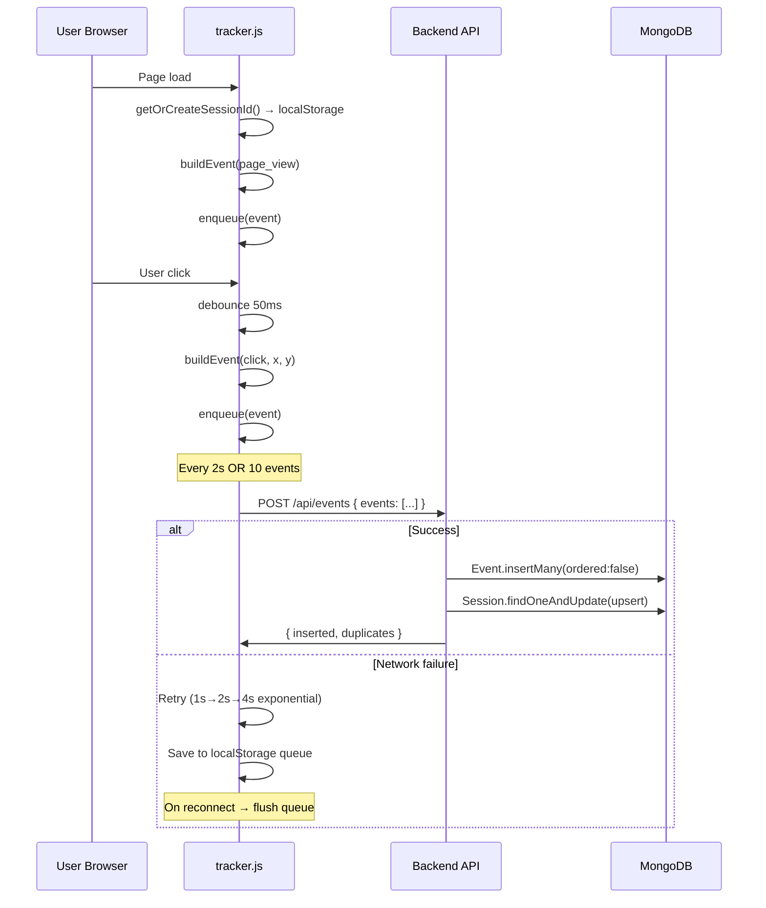
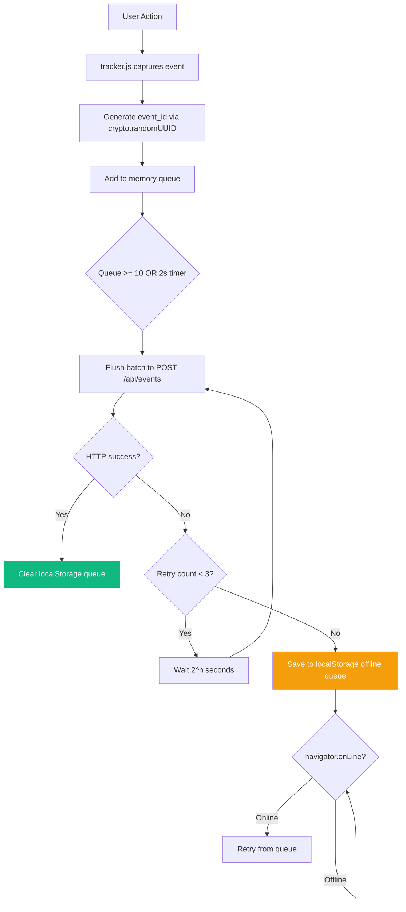
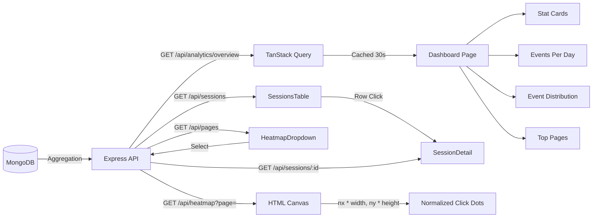

# Architecture

## System Overview

```
┌─────────────────────────────────────────────────────────────────┐
│                     Any Website / Demo Site                     │
│  ┌────────────────────────────────────────────────────────┐     │
│  │  <script src="tracker.js">                             │     │
│  │    • session_id (localStorage)                         │     │
│  │    • page_view on load / SPA navigate                  │     │
│  │    • click on document click                           │     │
│  │    • batch every 2s or 10 events                       │     │
│  │    • offline queue → retry on reconnect                │     │
│  └──────────────────────────┬─────────────────────────────┘     │
└─────────────────────────────│───────────────────────────────────┘
                              │  POST /api/events  { events: [] }
                              ▼
┌─────────────────────────────────────────────────────────────────┐
│                  Express.js Backend (Port 4000)                 │
│                                                                  │
│  ┌─────────────┐   ┌──────────────┐   ┌────────────────────┐   │
│  │   Helmet    │   │     CORS     │   │   Rate Limiter     │   │
│  │  (headers)  │   │  (whitelist) │   │  (500/15min write) │   │
│  └─────────────┘   └──────────────┘   └────────────────────┘   │
│                                                                  │
│  ┌─────────────────────────────────────────────────────────┐   │
│  │                    Route Layer                           │   │
│  │   POST /api/events       → EventsController             │   │
│  │   GET  /api/sessions     → SessionsController           │   │
│  │   GET  /api/sessions/:id → SessionsController           │   │
│  │   GET  /api/heatmap      → AnalyticsController          │   │
│  │   GET  /api/pages        → AnalyticsController          │   │
│  │   GET  /api/analytics/overview → AnalyticsController    │   │
│  └─────────────────────────────────────────────────────────┘   │
│                                                                  │
│  ┌─────────────────────────────────────────────────────────┐   │
│  │                   Service Layer                          │   │
│  │   events.service    → ingestEvents(), upsertSession()   │   │
│  │   sessions.service  → getSessions(), getDetail()        │   │
│  │   analytics.service → getOverview(), getHeatmap()       │   │
│  └─────────────────────────────────────────────────────────┘   │
│                                                                  │
│  ┌─────────────────────────────────────────────────────────┐   │
│  │                   Mongoose Models                        │   │
│  │   Event   { event_id[unique], session_id, ... }          │   │
│  │   Session { session_id[unique], totals, first/last_seen }│   │
│  └──────────────────────────┬──────────────────────────────┘   │
└─────────────────────────────│───────────────────────────────────┘
                              │
                              ▼
┌─────────────────────────────────────────────────────────────────┐
│                     MongoDB (Atlas / Local)                      │
│   events collection    ←── 6 indexes (dedup, session, heatmap)  │
│   sessions collection  ←── 3 indexes (id, last_seen, total)     │
└─────────────────────────────────────────────────────────────────┘
                              ▲
                              │  REST API calls
┌─────────────────────────────│───────────────────────────────────┐
│               Next.js 15 Dashboard (Port 3000)                   │
│                                                                  │
│  ┌─────────────────────────────────────────────────────────┐   │
│  │             TanStack Query (Client Cache)                │   │
│  │   30s staleTime, 60s refetch, 2 retries                  │   │
│  └─────────────────────────────────────────────────────────┘   │
│                                                                  │
│  ┌──────────────┐  ┌──────────────┐  ┌───────────────────┐    │
│  │  /dashboard  │  │  /sessions   │  │  /heatmap         │    │
│  │  Overview    │  │  Table +     │  │  Page selector +  │    │
│  │  Charts      │  │  Timeline    │  │  Canvas render    │    │
│  └──────────────┘  └──────────────┘  └───────────────────┘    │
│                                                                  │
│  ┌────────────────────────────────────────────────────────┐    │
│  │                   /demo (4 pages)                       │    │
│  │   Home • Products • Pricing • Contact                   │    │
│  │   All inject tracker.js for live testing               │    │
│  └────────────────────────────────────────────────────────┘    │
└─────────────────────────────────────────────────────────────────┘
```

---

## Event Flow



---

## Tracking Flow (Reliability)



---

## Dashboard Data Flow



---

## Heatmap Normalization

Raw click coordinates depend on the screen size of the user who clicked. To render heatmaps accurately across different devices, coordinates are normalized:

```
tracker captures:  x=250, y=400, viewport_width=1920, viewport_height=1080

Backend stores:    x, y, viewport_width, viewport_height  (all raw)
Backend returns:   nx = 250/1920 = 0.130
                   ny = 400/1080 = 0.370

Canvas renders:    canvasX = 0.130 * canvasWidth
                   canvasY = 0.370 * canvasHeight
```

This means a click at the center of a 1920×1080 screen and a click at the center of a 375×812 mobile screen both map to the same canvas position — providing accurate cross-device heatmaps.

---

## Deduplication Strategy

The tracker assigns each event a unique `event_id` before sending:

```js
event_id = "evt_" + crypto.randomUUID()
```

The backend uses MongoDB's unique index on `event_id` with `insertMany(ordered: false)`:

- Duplicate events (from retries) are silently rejected
- Non-duplicate events in the same batch are still inserted
- The response reports `{ inserted, duplicates, errors }` for observability

This makes the event ingestion pipeline **idempotent** — safe to retry without data corruption.

---

## Layer Responsibilities

| Layer | Responsibility |
|-------|---------------|
| `tracker.js` | Session ID, event capture, batching, reliability, offline queue |
| `controllers/` | HTTP parsing, validation delegation, response formatting |
| `services/` | Business logic, aggregation queries, database operations |
| `models/` | Schema definition, indexes, data shape |
| `hooks/` | TanStack Query wrappers, cache configuration |
| `services/api.ts` | Typed fetch wrapper, URL construction |
| `components/` | Pure UI — receives data as props, no data fetching |
