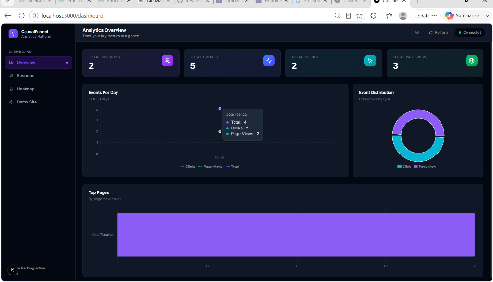
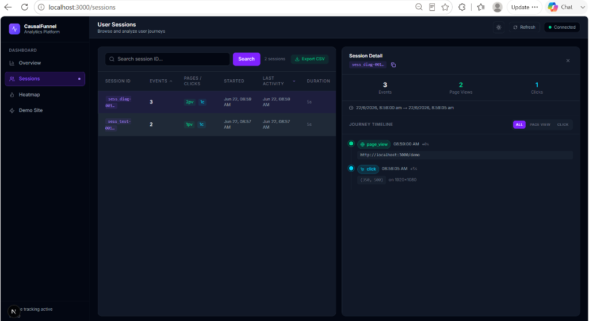
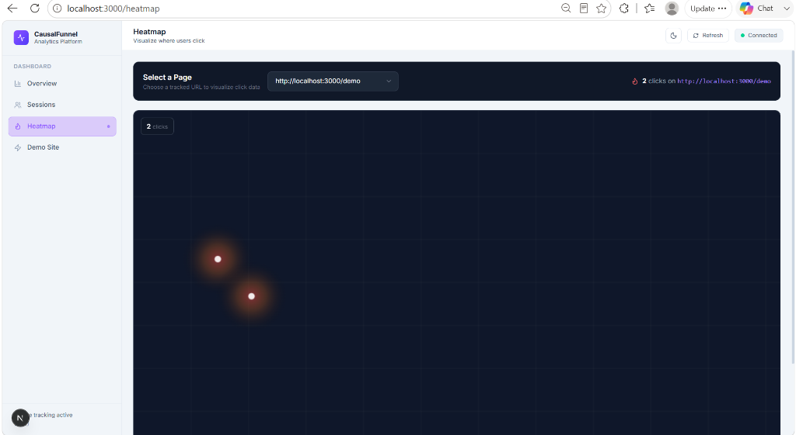
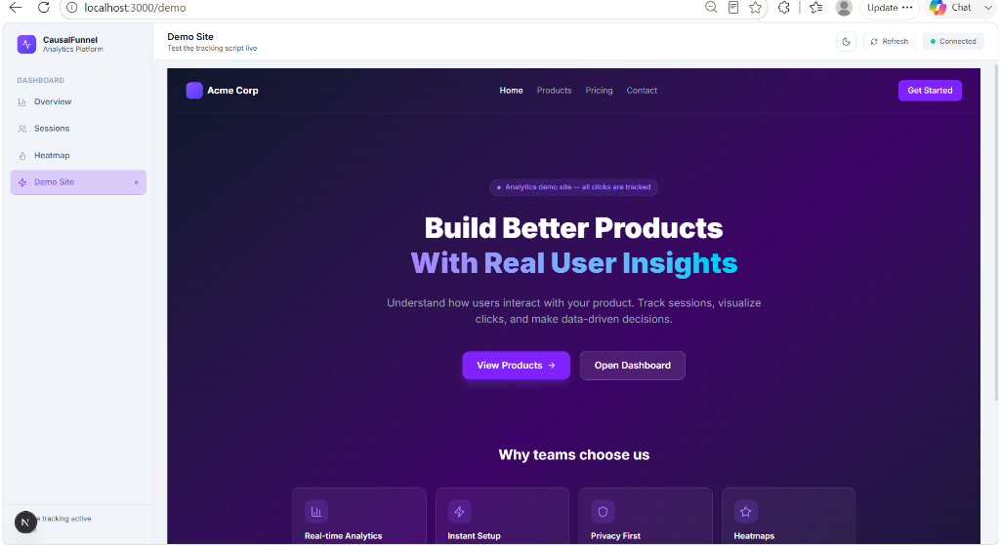

# CausalFunnel Analytics Platform

A production-ready, full-stack user analytics platform — a simplified Hotjar/Microsoft Clarity clone. Track sessions, page views, and clicks. Visualize data via heatmaps and timeline views.

---

## 🏗 Architecture Overview

```
Casual Funnel/
├── client/          # Next.js 15 + TypeScript dashboard
├── server/          # Express.js + TypeScript REST API
├── tracker/         # Embeddable vanilla JS tracking script
├── README.md
├── API.md
├── DATABASE.md
└── ARCHITECTURE.md
```

---

## 📸 Screenshots

| Dashboard | Sessions Viewer |
|:---:|:---:|
|  |  |

| Heatmap | Demo Site |
|:---:|:---:|
|  |  |

---

## ✨ Features

| Feature | Description |
|---------|-------------|
| 📊 Analytics Dashboard | Total sessions, events, clicks, page views |
| 📈 Charts | Events per day (line), distribution (pie), top pages (bar) |
| 👤 Session Browser | Searchable, sortable table with split-panel timeline |
| 🌙 Dark Mode | System/toggle-based dark and light themes |
| 📥 CSV Export | Export session data instantly to CSV format |
| 🔍 Event Filters | Filter session timelines by page views or clicks |
| 🔥 Heatmap | HTML Canvas density map with normalized coordinates |
| 🎯 Tracker Script | Embeddable JS — batching, retry, offline queue |
| 🛡 Security | Helmet, CORS, rate limiting, Zod validation |
| 📄 Documentation | API, Database, Architecture docs |

---

## 🚀 Quick Start

### Prerequisites

- Node.js 18+
- MongoDB (local or Atlas)

### 1. Clone / Open the project

```bash
cd "Casual Funnel"
```

### 2. Configure Environment

**Server:**
```bash
cd server
cp .env.example .env
# Edit MONGODB_URI, PORT, CLIENT_URL
```

**Client:**
```bash
cd client
# .env.local already configured for localhost
```

### 3. Install Dependencies

```bash
# Terminal 1 — Server
cd server && npm install

# Terminal 2 — Client
cd client && npm install
```

### 4. Run Development Servers

```bash
# Terminal 1 — Server (port 4000)
cd server && npm run dev

# Terminal 2 — Client (port 3000)
cd client && npm run dev
```

### 5. Test the Tracker

Navigate to `http://localhost:3000/demo` and click around. Open `http://localhost:3000/dashboard` to see data appear.

---

## 🌍 Environment Variables

### Server (`server/.env`)

| Variable | Default | Description |
|----------|---------|-------------|
| `MONGODB_URI` | `mongodb://localhost:27017/casualfunnel` | MongoDB connection string |
| `PORT` | `4000` | Server port |
| `CLIENT_URL` | `http://localhost:3000` | Allowed CORS origin |
| `NODE_ENV` | `development` | Environment (`development` \| `production`) |

### Client (`client/.env.local`)

| Variable | Default | Description |
|----------|---------|-------------|
| `NEXT_PUBLIC_API_URL` | `http://localhost:4000` | Backend API base URL |

---

## 🏭 Deployment

### Frontend → Vercel

```bash
# In /client
vercel deploy
# Set NEXT_PUBLIC_API_URL to your backend URL
```

### Backend → Render / Railway

```bash
# Build command: npm run build
# Start command: npm start
# Set all environment variables in dashboard
```

### Database → MongoDB Atlas

1. Create cluster at [mongodb.com/atlas](https://mongodb.com/atlas)
2. Get connection string
3. Set as `MONGODB_URI`

---

## 📡 Embedding the Tracker

```html
<!-- Basic usage -->
<script>
  window.CF_TRACKER_URL = 'https://your-backend.com/api/events';
</script>
<script src="https://your-cdn.com/tracker.js" async></script>

<!-- Manual event tracking -->
<script>
  window.CausalFunnel.track('custom_event', { plan: 'pro' });
</script>
```

---

## 🔒 Security

- **Helmet**: Sets secure HTTP headers
- **CORS**: Whitelist-based origin control
- **Rate Limiting**: 500 req/15min for events, 300 req/15min for reads
- **Zod Validation**: All POST bodies validated with typed schemas
- **Deduplication**: `event_id` unique index prevents replay attacks
